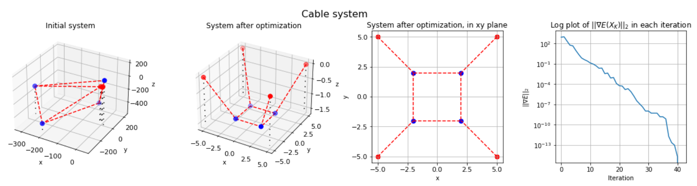

### TMA4180 Optimization I
# A Tensegrity Form-Finding Optimization Model

From art to engineering, tensegrity structures have revolutionized the world of construction.
Tensegrity structures, also called "smart structures", are mechanical structures constructed of
straight elastic members (called bars) and elastic cables that are connected at joints (or nodes),
and together guarantee the stability of the structure. These bars and cables are only compressed
and tensioned, and that is why the structure receives the name tensegrity, defying other kind of
structures.
The proposed optimization model provides a systematic and efficient way to determine the
shape of tensegrity structures and can have potential applications in the design and analysis of
various tensegrity-based systems in engineering and space exploration.

